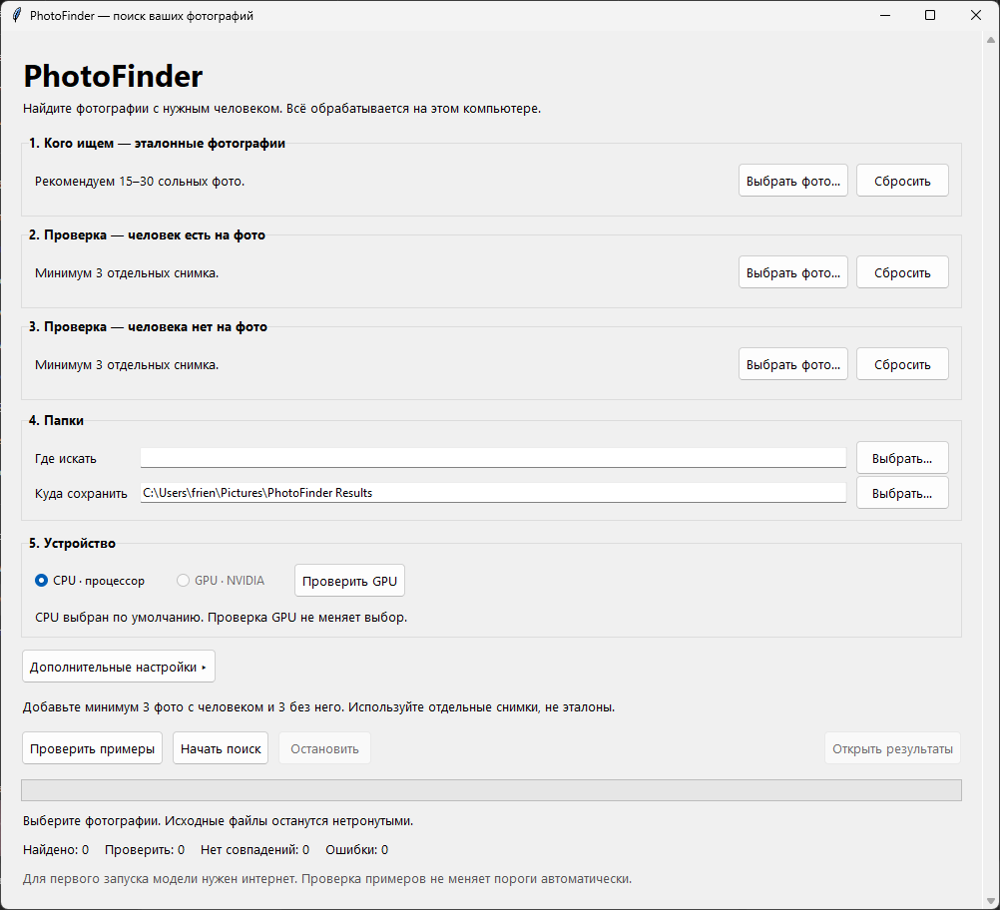
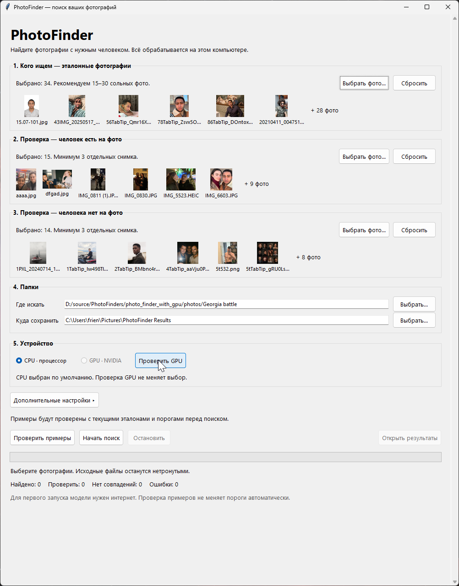
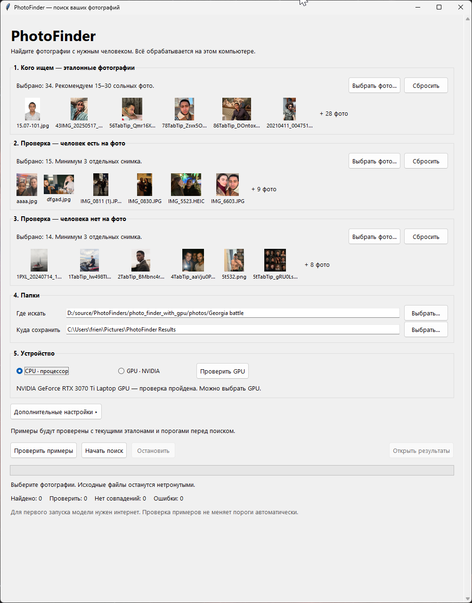
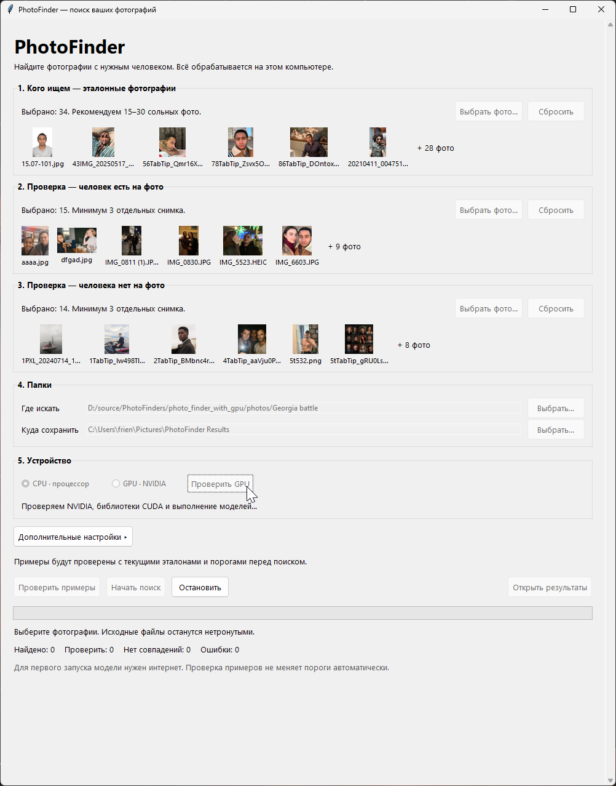
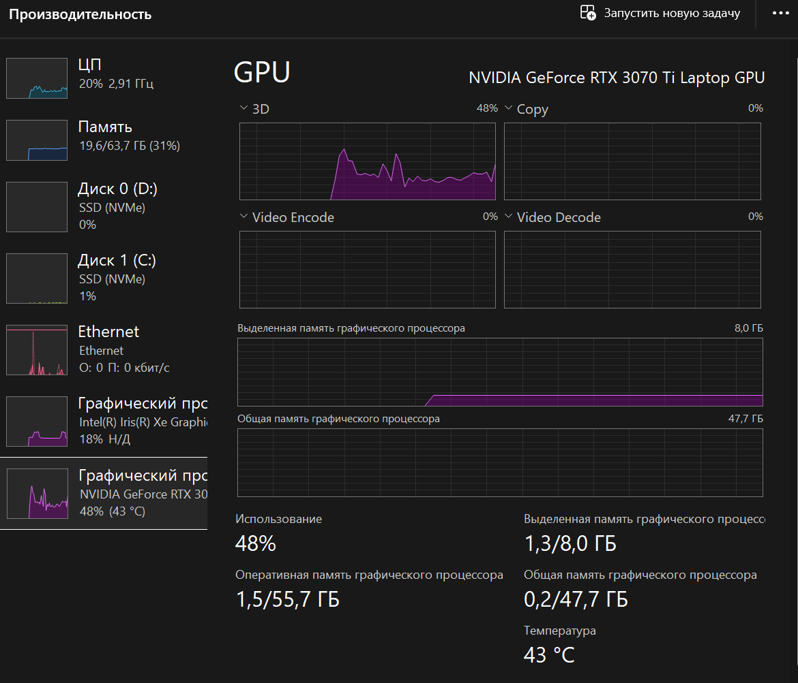
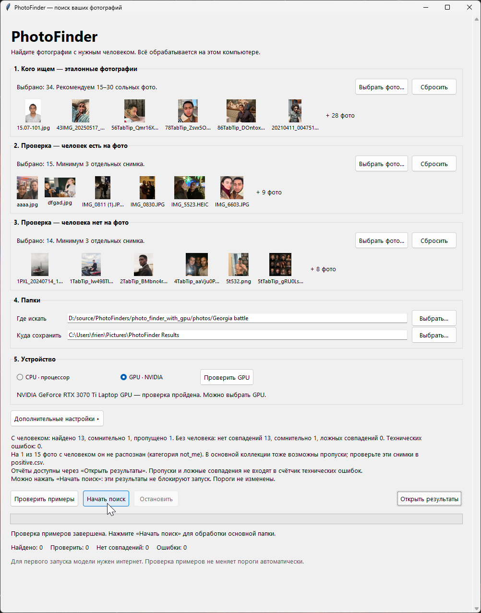
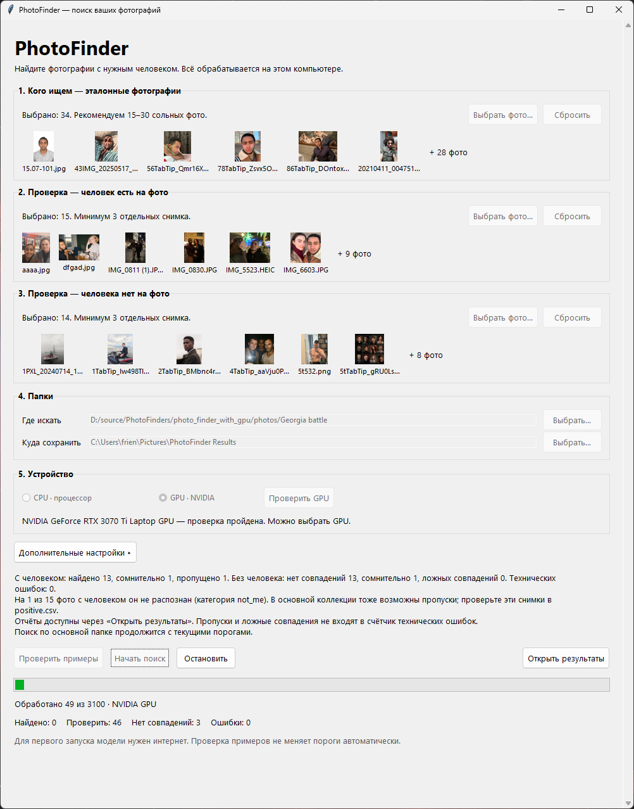
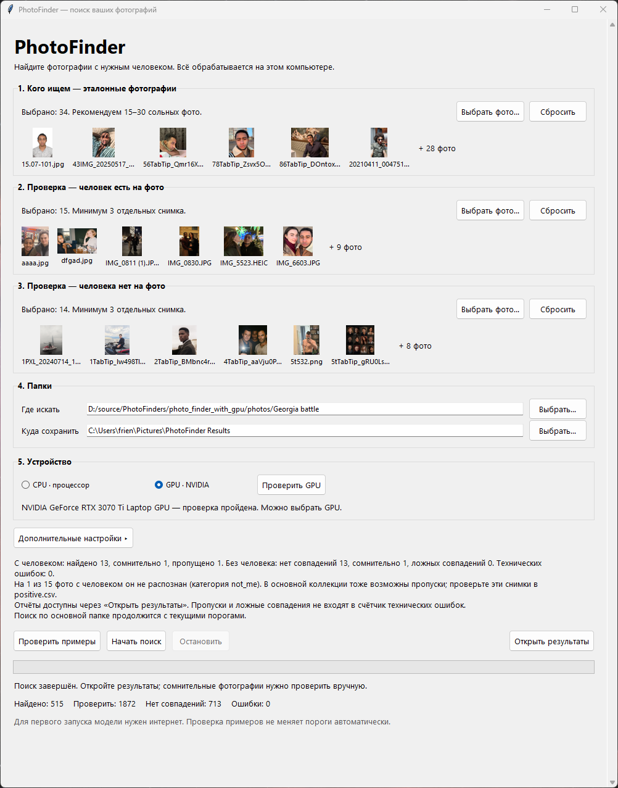

# PhotoFinder: пошаговая инструкция

В этом руководстве показан полный путь: от выбора фотографий до просмотра результата. PhotoFinder работает на вашем компьютере и не меняет исходные снимки.

## 1. Запустите приложение

Распакуйте архив в отдельную папку и запустите **PhotoFinder.exe**. Не перемещайте EXE отдельно от папки **_internal**. В собранной версии устанавливать Python не нужно. При первом запуске модели могут загружаться из интернета.

## 2. Выберите эталонные фотографии

В блоке «Кого ищем» нажмите «Выбрать фото…» и добавьте примерно 15–30 качественных снимков нужного человека. Лучше выбирать разные ракурсы и освещение; на каждом эталоне должно быть одно хорошо видимое лицо. Не используйте групповые кадры или снимки, где лицо слишком мелкое.

## 3. Добавьте проверочные примеры

В блок «человек есть на фото» добавьте не менее трёх отдельных снимков, где искомый человек точно присутствует. В блок «человека нет на фото» добавьте не менее трёх других снимков без него. Не повторяйте эталоны и не добавляйте копии одного кадра: примеры помогают оценить качество, но автоматически не меняют пороги.

## 4. Укажите папки

В «Где искать» выберите папку с исходной коллекцией. В «Куда сохранить» укажите отдельную папку для результатов. Приложение создаёт там копии и отчёты; оригиналы остаются на месте.

## 5. Выберите CPU или NVIDIA GPU

По умолчанию выбран CPU — этот вариант подходит для любого компьютера. Для NVIDIA установите совместимый драйвер и распакуйте оба дополнительных архива **PhotoFinder-NVIDIA-1-CuDNN.zip** и **PhotoFinder-NVIDIA-2-CUDA.zip** в ту же папку приложения, объединив файлы. Нажмите «Проверить GPU»: проверка сама не переключает устройство. После успешного теста выберите «GPU · NVIDIA».

Во время поиска нагрузку можно проверить в Диспетчере задач Windows на вкладке «Производительность».

Если GPU не определяется или проверка завершается ошибкой, выберите CPU. Для AMD, встроенной графики и ARM используйте CPU.

## 6. Проверьте примеры и начните поиск

Нажмите «Проверить примеры». PhotoFinder сопоставит их с эталонами и покажет найденные лица, пропуски и ложные совпадения. Это подсказка для оценки набора: предупреждения о качестве примеров не блокируют запуск и не меняют пороги. Если примеры подходят, нажмите «Начать поиск».

Во время обработки видны прогресс, число проверенных файлов и выбранное устройство. Кнопка «Остановить» прекращает поиск после текущей операции.

## 7. Откройте результаты

После завершения нажмите «Открыть результаты». Фотографии разложены по категориям:

- **me** — найдено достаточно уверенное совпадение;
- **uncertain** — нужен ручной просмотр; сюда могут попасть некачественные кадры и фото без распознанного лица;
- **not_me** — уверенного совпадения не найдено.

Просмотрите **uncertain** и выборку из **not_me**: человек со спины, с закрытым лицом или на очень маленьком/размытом снимке может быть пропущен. В папке результата также находятся отчёты CSV и JSON. Счётчик технических ошибок относится к проблемам чтения или обработки файлов; пропуски распознавания и сомнительные совпадения показываются отдельно.

## Примечание о примерах на скриншотах

На иллюстрациях видны выбранные автором фотографии и локальные пути к папкам. Для собственной проверки используйте свои снимки и папки.
